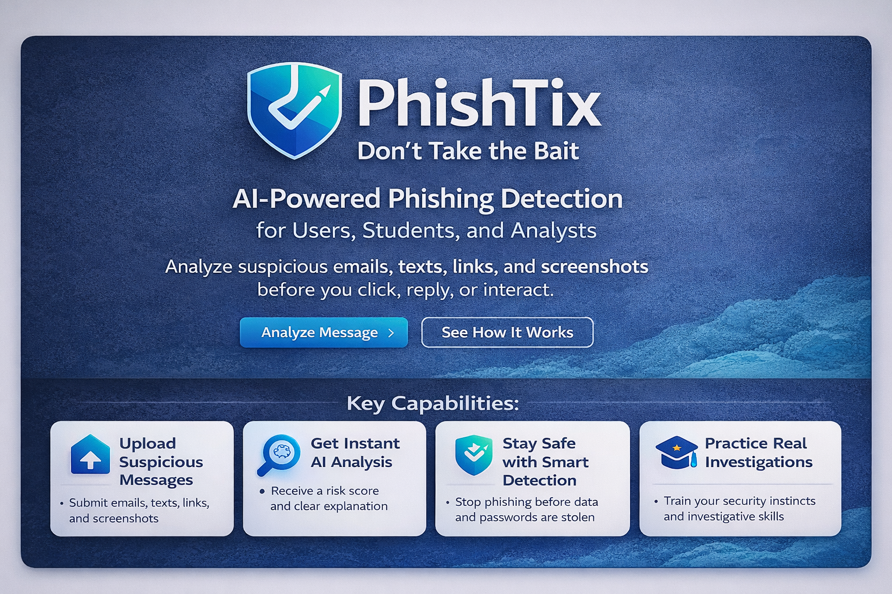

# PhishTix

**Don’t Take the Bait.**  
AI-powered phishing detection and awareness for users, students, and analysts.

## ## How PhishTix Works

PhishTix is designed as a lightweight interface where users can submit suspicious messages for analysis.

Example inputs may include:

• suspicious emails  
• text messages (smishing)  
• phone scam transcripts (vishing)  
• suspicious links or screenshots  

The system would analyze these inputs and present:

• phishing indicators  
• risk score  
• explanation of detected patterns  
• recommended user action

## Overview

PhishTix is a cybersecurity project focused on helping people identify, understand, and respond to phishing attempts more effectively. The project is designed with a dual purpose:

1. **User education and awareness** — making phishing detection easier for everyday users and students  
2. **Analyst-aligned workflow thinking** — presenting suspicious messages in a way that supports structured review, documentation, and investigation

PhishTix was created as part of my growing cybersecurity portfolio to demonstrate practical thinking around phishing detection, user protection, and security communication.

## Educational Purpose

PhishTix is a cybersecurity portfolio project designed to explore phishing detection, user awareness, and analyst-style investigation workflows. The project is intended for learning, demonstration, and portfolio review by recruiters, educators, and cybersecurity professionals.

## Why This Project Matters

Phishing remains one of the most common and effective attack methods used against individuals and organizations. Many users still struggle to tell the difference between legitimate communication and malicious impersonation, urgency scams, fake support messages, credential theft attempts, and other social engineering tactics.

PhishTix explores how a tool can help bridge that gap by combining:
- security awareness
- simplified phishing analysis
- structured triage thinking
- educational design for technical and non-technical users

## Project Goals

- Help users identify suspicious messages more confidently
- Present phishing indicators in a clearer and more understandable way
- Encourage safer response behavior
- Support entry-level analyst thinking and documentation practice
- Demonstrate cybersecurity product design and problem-solving

## Intended Audience

PhishTix is being designed for:
- students learning cybersecurity
- everyday email and mobile users
- entry-level SOC learners
- faculty and educational demonstration settings
- awareness training and seminar use cases

## Current Status

This repository is the **public portfolio and documentation version** of PhishTix.  
It is intended to showcase the project’s purpose, design thinking, and development direction without exposing private implementation details.

## Repository Contents

This public repository includes:
- product overview
- problem statement
- target users
- roadmap
- analyst workflow concepts
- branding and visual assets
- presentation-friendly documentation

This repository does **not** include private backend logic, internal detection methods, or unreleased implementation details.

## Skills Demonstrated

Through this project, I am demonstrating growth in:
- phishing awareness and detection thinking
- cybersecurity documentation
- security-focused product design
- user-centered communication
- analyst workflow structure
- portfolio development
- technical project planning

## Educational and Portfolio Purpose

PhishTix is part of my broader cybersecurity learning journey and portfolio development. It is intended to support:
- recruiter review
- academic showcase opportunities
- seminar and presentation use
- transfer and education discussions
- cybersecurity project documentation

## Future Direction

Planned future development includes:
- expanded phishing analysis workflows
- safer message review experiences
- user-facing educational features
- analyst-oriented triage concepts
- improved prototype and interface refinement

## Author

**Raynard A. Porter**  
Cybersecurity student | Home lab builder | Security portfolio developer

## Note

This repository is a public-facing showcase version of the project. Some technical details are intentionally omitted to protect ongoing development and preserve implementation privacy.
